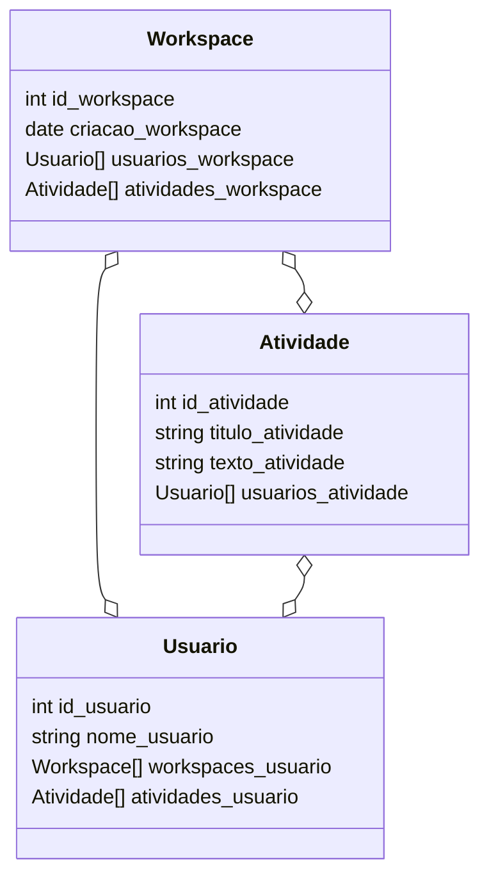
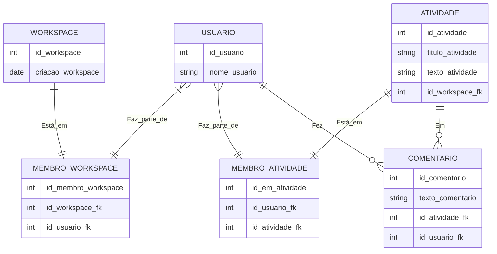

# Documentação da TaskHub

## Singleton e Composite
### Singleton
É um padrão de projeto de software definido por uma classe que não pode ser reinstânciada, ou seja, um único objeto é criado e utilizado durante todo o funcionamento. Nesse projeto, é utilizado para a conexão com o banco de dados. 

### Composite
Composite é um padrão de projeto usado para formar objetos a partir da união de outros objetos similares numa estrutura de árvore partes-todo. Nesse projeto, é utilizada para criação de alguns elementos gráficos.


## Utilização de Interfaces e Traços
### Interfaces
Interfaces são utilizadas para construir "contratos" que definem métodos que devem, obrigatóriamente, ser implementados numa classe. As interfaces também podem ser utilizadas para possibilitar o polimorfismo, o qual abstrai a estrutura de alguns componente.

#### Polimorfismo
Conceito de OOP que visa criar estruturas únicas que podem processar diferentes tipos de objetos. As interfaces são utilizadas para definir que, ao invés de passar um parâmetro tipado com uma classe, uma função aceite qualquer objeto que contenha as assinaturas implementadas por ela.

### Traços 
Os traços são usados para implementar propriedades e métodos à uma classe. São utilizados, nesse projeto, para reduzir código repetido entre várias classes. Em alguns casos, implementam os métodos definidos pelas interfaces.  

## Classes abstratas
Classes abstratas determinam propriedades e métodos de uma classe. Essa classe não pode ser instânciada diretamente, para ser utilizada ela deve ser herdada (<code>extends</code>) por outra classe. Nesse projeto, é utilizada, por exemplo, para definir características e funcionalidades inatas para todos os componentes. 

## Estrutura para documentação dentro do código

```php
/**
     * Texto que explica a função ou método.
     *
     * @param Tipo $parametro
     * @return string|null Valor de retorno.
     */
```

<br>
<h2>Diagramas</h2>

Diagrama de classes **Adicionar os métodos**



Diagrama de relacionamentos (banco de dados)


