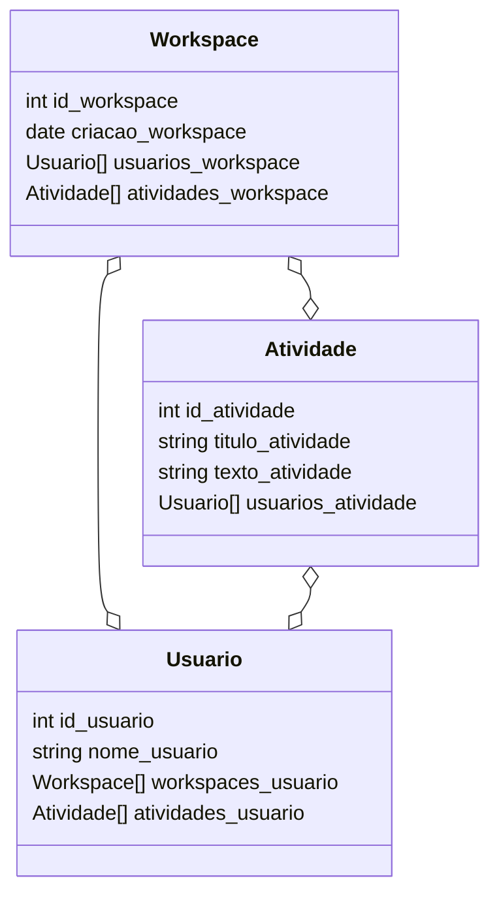
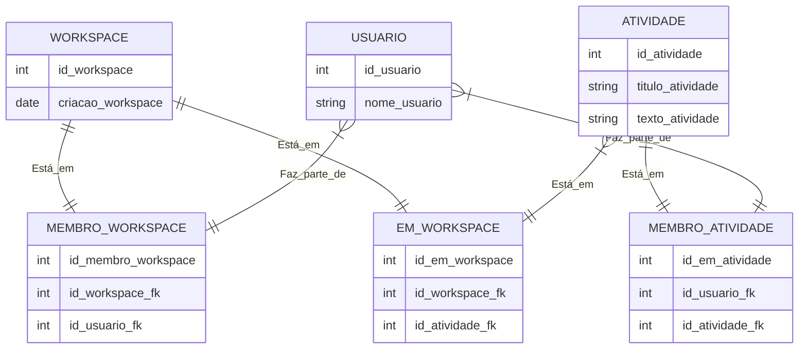

# Documentação da TaskHub

 
<h2>Diagramas</h2>

Diagrama de classes

```mermaid 
classDiagram
    class Workspace{
        int id_workspace
        date criacao_workspace
        Usuario[] usuarios_workspace
        Atividade[] atividades_workspace
    }

    class Atividade{
        int id_atividade
        string titulo_atividade
        string texto_atividade
        Usuario[] usuarios_atividade 
    }

    class Usuario{
        int id_usuario
        string nome_usuario
        Workspace[] workspaces_usuario
        Atividade[] atividades_usuario
    } 

    Workspace o--o Atividade
    Workspace o--o Usuario
    Atividade o--o Usuario

```

Diagrama de relacionamentos (bando de dados)

```mermaid
erDiagram
    WORKSPACE 1--1 MEMBRO_WORKSPACE : Está_em
    USUARIO 1+--1 MEMBRO_WORKSPACE : Faz_parte_de

    ATIVIDADE 1--1 MEMBRO_ATIVIDADE : Está_em
    USUARIO 1+--1 MEMBRO_ATIVIDADE : Faz_parte_de

    WORKSPACE 1--1 EM_WORKSPACE : Está_em
    ATIVIDADE 1+--1 EM_WORKSPACE : Está_em

    WORKSPACE {
        int id_workspace
        date criacao_workspace
    }

    EM_WORKSPACE {
        int id_em_workspace
        int id_workspace_fk
        int id_atividade_fk
    }

    MEMBRO_WORKSPACE {
        int id_membro_workspace
        int id_workspace_fk
        int id_usuario_fk
    }

    ATIVIDADE {
        int id_atividade
        string titulo_atividade
        string texto_atividade
    }

    MEMBRO_ATIVIDADE {
        int id_em_atividade
        int id_usuario_fk
        int id_atividade_fk
    } 

    USUARIO {
        int id_usuario
        string nome_usuario
    } 
```

